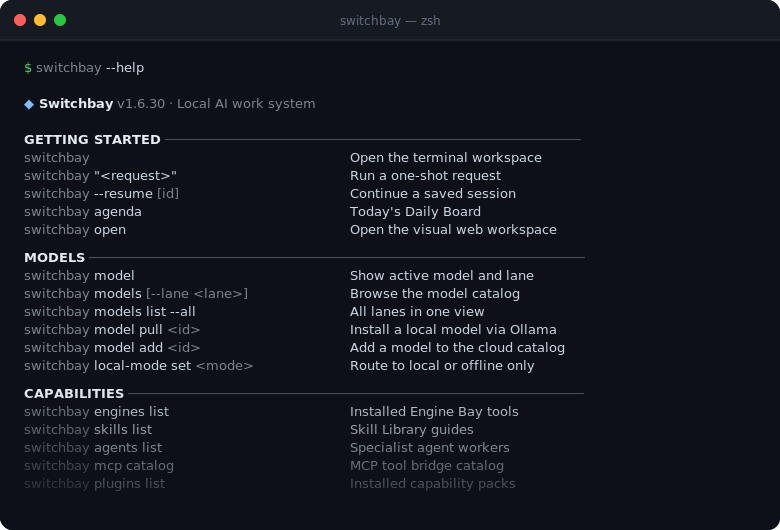
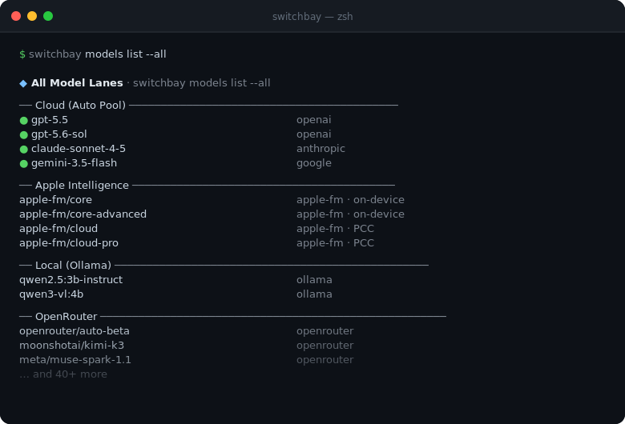

# Switchbay

[](#)
[](https://bun.sh)
[](#license)

**One persistent AI agent. Every model. Your terminal.**

Switchbay is not a wrapper. It's an agent that reasons, plans, uses tools, and remembers — across sessions, projects, and providers. Swap models mid-session without losing context. Run fully local. Extend it with a JSON file.

```bash
brew tap genoventures-labs/tap
brew install switchbay
switchbay
```



---

## What it does

**Routes across every model without breaking your flow.**

Cloud auto-routes between OpenAI, Anthropic, and Google by task type. Apple Intelligence runs on-device via AFM, escalating to Private Cloud Compute only when the task needs it. Local Ollama, llama.cpp, and MLX work the same way — just point Switchbay at a running server. Switch lanes mid-session with a single word.

```
Claude, audit this PR
GPT, give me a second opinion
Auto, pick the best model for what's next
```



**Remembers everything that matters.**

Sessions carry forward. Memory persists across repos. Knowledge is indexed locally. Every turn produces a durable trace you can query, replay, or hand off to the next session.

**Extends without touching the core.**

Drop a JSON manifest into `.switchbay/engines/` and new tools are live immediately — no restarts, no code changes. Bundle agents, skills, and engines into a plugin. Share it with your team.

```bash
switchbay "find the auth bug"          # one-shot
switchbay --resume                     # pick up where you left off
switchbay --agent security "review PR" # activate a specialist
switchbay model pull llama3.2 -y       # install a local model
switchbay local-mode set offline       # go fully air-gapped
```

---

## For developers

**Local API**

```bash
switchbay serve

curl -s http://127.0.0.1:7349/v1/turn \
  -H 'content-type: application/json' \
  -d '{"input":"Review the auth flow","workspace":"/path/to/project"}'
```

```ts
import { Switchbay } from "@genoventures/switchbay";
const bay = new Switchbay({ token: process.env.SWITCHBAY_API_TOKEN, workspace: "/path/to/project" });
const turn = await bay.turn({ input: "Review the auth flow." });
```

**Engine Bay** — drop-in tools via JSON manifest

```json
{
  "id": "my-engine",
  "tools": [{
    "name": "run_tests",
    "description": "Run the test suite and return results.",
    "command": "bun test --reporter json",
    "parameters": {}
  }]
}
```

Place in `.switchbay/engines/` — live on next turn. Community engines via `switchbay engines sync`.

**Model lanes**

| Lane | Providers |
|---|---|
| `cloud` | OpenAI · Anthropic · Google (auto-routed) |
| `apple` | AFM 3 Core · Core Advanced · Cloud · Cloud Pro (PCC) |
| `local` | Ollama · llama.cpp · MLX |
| `openrouter` | 200+ models |
| `huggingface` | HF Inference Providers |

Set via `SWITCHBAY_LANE` env var, `--lane` flag, or `/lane` mid-session.

Full docs: [docs/](docs/)

---

MIT
