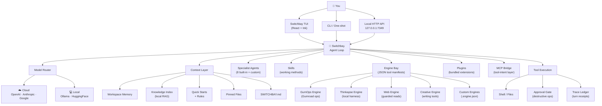

# Switchbay

[](#)
[](https://bun.sh)
[](https://github.com/vadimdemedes/ink)
[](#model-lanes)
[](#engine-bay)
[](#skills)
[](#plugins)
[](#license)

**Switchbay is your AI development operating system.** One intelligent agent — Switchbay — that lives in your terminal, knows every project you work in, routes across every model without breaking your flow, and can be extended with engines, skills, agents, and plugins without ever touching its core.

Most AI coding tools give you a chat window bolted onto a model. Switchbay gives you a **platform**.

> Switchbay isn't a chatbot. Switchbay is your AI co-pilot — persistent, context-aware, and extensible.

---

## The Idea

The AI landscape is moving faster than any one tool can keep up with. Models get better, providers change, teams ship new APIs. If your workflow is tied to one model or one UI, you're rebuilding constantly.

Switchbay bets on a different architecture:

- **The model is interchangeable.** Switchbay routes between OpenAI, Anthropic, Google, and Ollama — mid-session, mid-task, without restarting anything. Best model for the job, every time.
- **Context is owned, not rented.** Switchbay builds a persistent memory of your workspace — decisions, facts, pinned files, sourced knowledge — and carries it across every session. It doesn't ask you the same questions twice.
- **Capabilities are composable.** Drop a JSON engine manifest and Switchbay gains new callable tools. Write a skill file and Switchbay gains a new working method. Bundle agents, engines, and rules into a plugin and share it across every repo you work in.
- **You stay in control.** Every shell command, every publish, every broad or irreversible action goes through an explicit approval gate. Switchbay works fast. It doesn't act blind.

This is what "AI-native tooling" actually looks like — not a wrapper, a workbench.

---

## Architecture



---

## Install

```bash
brew tap genoventures-labs/tap
brew install switchbay
switchbay
```

From source:

```bash
bun install
bun link
switchbay --help
```

Linux Mint users can install the CLI and persistent local API together with the [Linux Mint installer](docs/LINUX_MINT_INSTALL.md).

Run as a persistent background service so the local API is always available:

```bash
switchbay service install
switchbay service status
```

---

## What Switchbay Actually Does

Switchbay is not a command runner with AI sprinkled on top. Switchbay is an **agent** — it plans, reasons, uses tools, reads and writes your codebase, and surfaces decisions to you when they matter.

```bash
switchbay                              # open the full TUI cockpit
switchbay "find the auth bug"          # one-shot, no session needed
switchbay --resume                     # pick up exactly where you left off
switchbay --agent security "review PR" # activate a specialist, run a task
switchbay serve                        # start the local API for integrations
switchbay update                       # sync commits, push, pull latest, reinstall
```

**On any given task, Switchbay will:**

- Read the relevant files and understand the current state of the code before touching anything
- Form a plan, show you what it intends to do, and execute step-by-step
- Switch specialist agents mid-session — debugger to architect to code reviewer — without losing context
- Pull relevant context from workspace memory, pinned files, and the knowledge index automatically
- Run shell commands, install dependencies, run tests, and format output — all locally
- Gate anything destructive or high-impact (publishes, force-pushes, refunds, disk ops) behind explicit approval
- Write a durable trace receipt for every completed turn so nothing is a black box

Switchbay isn't helpful when you ask it nicely. Switchbay is operational — it has working modes, specialist personas, memory, and context. It's the difference between a calculator and a co-pilot.

---

## Model Lanes

The model is a variable. Switchbay is the constant.

Switch providers, pull new models, and pin lanes — without changing how you work or what Switchbay knows about your project.

Addressing a model by name pins its configured default for following turns. Call another model to replace the pin, or use `Auto, ...` or `/auto` to restore trusted automatic routing:

```text
Claude, inspect this repo
GPT, review Claude's plan
Gemini, research the alternatives
Auto, choose the best model for the next step
```

```bash
# Cloud (auto-routes between OpenAI, Anthropic, Google by intent)
export SWITCHBAY_LANE=cloud
export SWITCHBAY_CLOUD_PROVIDER=auto
export OPENAI_API_KEY=...
export ANTHROPIC_API_KEY=...
export GOOGLE_API_KEY=...

# Local via Ollama
export SWITCHBAY_LANE=local
export SWITCHBAY_OLLAMA_MODEL=llama3.2

# Hosted open models via Ollama Cloud
export OLLAMA_API_KEY=...
switchbay --lane ollama-cloud "analyze this repository"

# Explicit model selection through OpenRouter (never used by auto-routing)
export OPENROUTER_API_KEY=...
export SWITCHBAY_OPENROUTER_MODEL=openai/gpt-5.2
switchbay --lane openrouter "review this change"

# Hosted Hugging Face inference (explicit/contained lane only)
export HF_TOKEN=...
export SWITCHBAY_HF_MODEL=openai/gpt-oss-120b:groq
switchbay --lane huggingface "inspect this change"
```

Pull and manage models without leaving Switchbay:

```bash
switchbay model pull ibm/granite-4-micro
switchbay model pull https://huggingface.co/lmstudio-community/gpt-oss-20b-GGUF --quant Q4_K_M
```

TUI lane controls — instant, mid-session, no restart:

```text
/lane openai · /lane anthropic · /lane gemini · /lane huggingface · /lane openrouter · /lane ollama · /lane ollama-cloud
```

Pin a one-shot image turn directly to OpenAI vision:

```bash
switchbay --vision ./screenshot.png "inspect this layout"
switchbay --vision https://example.com/screen.png "describe the UI issue"
```

Auto-routing picks the right cloud model by intent — code-heavy work goes to Anthropic, structured tasks and vision go to OpenAI, and research or long-context synthesis goes to Gemini. Every completed turn logs the decision:

```text
Using: cloud/anthropic/claude-sonnet-4-5 · intent=code_work · mode=auto
```

Trust zones stay explicit: automatic routing is limited to OpenAI, Anthropic, and Gemini; local work stays on Ollama; Hugging Face, OpenRouter, and Ollama Cloud run only when directly selected.

Full reference: [MODEL_LANES.md](docs/MODEL_LANES.md)

---

## Specialist Agents

Eight specialist modes. Activate a specialist and Switchbay's entire operating lens shifts — priorities, review criteria, what it calls out, what it refuses to do — without changing your session, context, or tools.

| Agent | Activates on | Focus |
|---|---|---|
| 🎨 UI Designer | `/agent ui-designer` | Hierarchy, accessibility, components, design systems |
| ⚙️ Backend Engineer | `/agent backend` | APIs, DB schema, auth, query performance |
| 🚀 DevOps | `/agent devops` | CI/CD, containers, infra, observability |
| 🔍 Debugger | `/agent debugger` | Root cause analysis, bisect, reproduction |
| 🏗️ Architect | `/agent architect` | System design, tradeoffs, long-term structure |
| 🔒 Security | `/agent security` | Threat modeling, injection, auth, secrets |
| 📝 Tech Writer | `/agent docs` | Accuracy, reader-first, working examples |
| 👁️ Code Reviewer | `/agent reviewer` | Blocking issues, edge cases, test gaps |

Build your own with `/create-agent` — specialist agents for your domain, your stack, your codebase patterns. Full reference: [AGENTS.md](docs/AGENTS.md)

---

## Engine Bay

Engines are the extension layer. A JSON manifest drops new callable tools into Switchbay without touching source code, without restarting, without configuration rituals.

```json
{
  "id": "demo",
  "name": "Demo Engine",
  "tools": [
    {
      "name": "say",
      "description": "Print text.",
      "command": "printf {{text}}",
      "parameters": { "text": { "type": "string" } },
      "required": ["text"]
    }
  ]
}
```

Drop it in `.switchbay/engines/` and Switchbay picks it up. The GitHub-backed Engine Bay gives you community templates on demand:

```bash
switchbay engines sync
```

**Built-in engines:**
- **Web Engine** — guarded public URL reads, no private host access, cites sources
- **Creative Engine** — briefs, naming packets, positioning, hooks, copy drafting, content calendars

**Auto-discovered engines** (when paths are set):
- **GumOps** — Gumroad ops, sales queries, product management, refund gating
- **Thinkapse** — local capture/triage/routing harness, agent inspection, memory tools

Full reference: [ENGINE_BAY.md](docs/ENGINE_BAY.md)

---

## Skills

Skills are reusable working methods — Switchbay reads them before tackling a task and applies the method, not just the answer.

Built-in: `code-review-pass`, `debugging-triage`, `implementation-plan`, `release-readiness`, `test-strategy`, `ui-polish-pass`, `api-contract-check`, `web-research`

```bash
switchbay skills sync              # pull latest from GitHub
switchbay skills read release-readiness
```

Write your own. A skill is a markdown file with frontmatter — a named method that lives in your workspace or user config and follows you across projects. The TUI checks for updates on startup and syncs with one keypress.

Full reference: [SKILLS.md](docs/SKILLS.md)

---

## Plugins

Plugins are the packaging layer. Bundle everything — agents, engines, skills, quick-start guides, knowledge files, MCP config — into a single portable manifest your whole setup loads automatically.

```json
{
  "id": "repo-ops",
  "name": "Repo Ops",
  "agents": ["agents/repo-steward.md"],
  "skills": ["skills/repo-check.skill.md"],
  "engines": ["engines/repo-tools.engine.json"],
  "guides": ["guides/repo-domain.md"]
}
```

Drop it in `.switchbay/plugins/<id>/plugin.json` and it's live — no registration, no restarts. Full reference: [PLUGINS.md](docs/PLUGINS.md)

---

## Persistent Context

Switchbay never starts from scratch. Every session loads a full context layer built from your workspace:

| Source | What It Carries |
|---|---|
| `~/.switchbay/context/` | Private machine-local profile, work style, preferences, active projects, and boundaries |
| `SWITCHBAY.md` | Project overview, stack decisions, permanent context |
| `.switchbay/memory/` | Session memories, operational facts, auto-refreshed summaries |
| `.switchbay/knowledge/` | Local knowledge index — code, docs, rules, sourced snippets |
| `.switchbay/traces/` | Durable receipts for every completed turn |
| `.switchbay/pins.json` | Files that are always in context, no matter what |
| `~/.switchbay/rules/` | Your personal operating rules, across every repo |
| `~/.switchbay/quickstarts/` | How Switchbay should act in specific tool or domain contexts |

Switchbay reads memory before every session, cites knowledge sources inline, and writes trace receipts after every turn. Full reference: [MEMORY_KNOWLEDGE_TRACES.md](docs/MEMORY_KNOWLEDGE_TRACES.md)

---

## Local API

Switchbay isn't just a TUI. It's a local API server — so you can power editor integrations, desktop sidebars, automation scripts, and internal tools with the same Switchbay that runs in your terminal.

```bash
switchbay serve

curl -s http://127.0.0.1:7349/v1/turn \
  -H 'content-type: application/json' \
  -d '{"input":"Review the auth flow","workspace":"/path/to/project"}'
```

TypeScript client:

```ts
import { Switchbay } from "@genoventures/switchbay";

const bay = new Switchbay({ token: process.env.SWITCHBAY_API_TOKEN, workspace: "/path/to/project" });
const turn = await bay.turn({ input: "Review the auth flow." });
```

Full reference: [API_INTEGRATION.md](docs/API_INTEGRATION.md)

---

## Common TUI Commands

```text
/help                       Open the capability and keyboard guide
/lane · /model              Switch provider or model, mid-session
/auto                       Restore trusted cloud auto-routing
/agent <id>                 Activate a specialist agent
/plan                       Generate and execute a step-by-step plan
/remember                   Save a workspace memory
/pin                        Pin a file into future context
/search                     Search the workspace knowledge index
/native                     Inspect isolated and provider-managed tools
/skills sync                Pull latest skills from GitHub
/engines                    List registered engines
/trace                      Show the latest turn receipt
/resume                     Resume a previous session
/checkpoint                 Save a git-stash checkpoint
/create-rule                Build a custom operating rule
/create-agent               Define a custom specialist agent
/create-engine              Create a new engine manifest
/create-plugin              Bundle everything into a plugin
```

Full reference: [SLASH_COMMANDS.md](docs/SLASH_COMMANDS.md)

---

## Documentation

| Doc | Contents |
|---|---|
| [MODEL_LANES.md](docs/MODEL_LANES.md) | Cloud, local, MCP bridge, auto-routing, per-command overrides |
| [MCP_BRIDGE.md](docs/MCP_BRIDGE.md) | Switchbay MCP bridge — config format, trusted catalog, enabling |
| [AGENTS.md](docs/AGENTS.md) | Built-in specialist agents, custom agent authoring, activation |
| [ENGINE_BAY.md](docs/ENGINE_BAY.md) | Engine manifests, GitHub sync, Web/Creative/GumOps/Thinkapse engines |
| [SKILLS.md](docs/SKILLS.md) | Built-in skills, custom skill authoring, GitHub sync |
| [PLUGINS.md](docs/PLUGINS.md) | Plugin manifest format, asset types, creating plugins |
| [MEMORY_KNOWLEDGE_TRACES.md](docs/MEMORY_KNOWLEDGE_TRACES.md) | Memory, Knowledge Index, Trace Ledger, Quick Starts/Rules |
| [MODEL_READINESS.md](docs/MODEL_READINESS.md) | Workspace profiles, durable plans, automatic knowledge, workflows, context receipts |
| [NATIVE_TOOLS.md](docs/NATIVE_TOOLS.md) | Provider-managed tools, provider-native interfaces, and Switchbay's isolated model environment |
| [USAGE_COSTS.md](docs/USAGE_COSTS.md) | Session/day/week/lifetime usage graphs and approximate API spend |
| [USER_CONTEXT.md](docs/USER_CONTEXT.md) | Private machine-local profile, work style, active-project, preference, and boundary context |
| [QUICKSTARTS_AND_RULES.md](docs/QUICKSTARTS_AND_RULES.md) | The quickstarts Switchbay reads before acting, how to write your own |
| [SLASH_COMMANDS.md](docs/SLASH_COMMANDS.md) | Complete TUI slash command reference |
| [APPROVAL_MODEL.md](docs/APPROVAL_MODEL.md) | What gates for approval, what runs freely |
| [API_INTEGRATION.md](docs/API_INTEGRATION.md) | Local HTTP API and TypeScript client |
| [LOCAL_API_README.md](docs/LOCAL_API_README.md) | Local API route design |
| [1.0_SMOKE_CHECKLIST.md](docs/1.0_SMOKE_CHECKLIST.md) | Release-readiness smoke test checklist |
| [1.5_ROADMAP.md](docs/1.5_ROADMAP.md) | Switchbay operator direction and roadmap |

---

## Development

```bash
bun install
bun test
bun run build
bun index.tsx        # run from source
switchbay update     # commit local changes, push, pull latest, reinstall
```

---

## License

MIT
